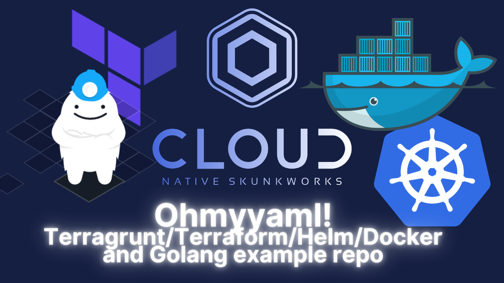

[](https://youtu.be/AktpY84UBAk "Ohmyyaml!")

_This repository is primarily for education purposes and shows how to scale out infrastructure in terms of workspaces and services at a large scale_

This repository effectively deploys a small server displaying an image of a Gopher on the internet.

[What the heck is Terragrunt?](https://youtu.be/LuKYu9ASGyo)

A journey into "modern" DevOps deployment practices.
- Terragrunt
- Terraform
- Helm/Docker/Golang

The purpose of this repo is to show a simple app, how its packaged in Docker/Helm then deployed to Kubernetes.


## Flow

Terragrunt has two callable Terraform modules
- The first will deploy an EKS cluster out
- The second will deploy applications through Terraform helm provider onto the cluster 

## Requirements

- AWS_ACCESS_KEY_ID and AWS_SECRET_ACCESS_KEY
- TERRAFORM_WORKSPACE_TOKEN for TF cloud
- CR_PAT for the GitHub container registry

## Terragrunt local usage

Terragrunt can operate either using a remote Git tag or with local source mode.
Local source mode is ideal for local development.


```
❯ make terragrunt-plan-infra
cd regional_configurations/eu-west-1/infrastructure_substrate && \
	trap "cd ../../../" SIGINT SIGTERM ERR EXIT && \
	terragrunt plan --terragrunt-source ../../../module_catalogue/infrastructure_substrate
WARN[0000] No double-slash (//) found in source URL /Users/alexjones/Code/ohmyyaml/module_catalogue/infrastructure_substrate. Relative paths in downloaded Terraform code may not work.
Initializing modules...
Downloading terraform-aws-modules/eks/aws 17.24.0 for eks...
- eks in .terraform/modules/eks
- eks.fargate in .terraform/modules/eks/modules/fargate
- eks.node_groups in .terraform/modules/eks/modules/node_groups

Initializing the backend...
```

### Helm OCI Chart

Helm 3 supports [OCI](https://helm.sh/docs/topics/registries/) for package distribution. Chart packages are able to 
be stored and shared across OCI-based registries.

There is an additional task in the Makefile to build the OCI chart.

```
create-oci-helm-chart:
	helm package ./app/charts/ohmyyaml
	helm push ohmyyaml-*.tgz oci://ghcr.io/tibbar/ohmyyaml
```

To deploy the chart, you need to login to the ghcr.io registry via the `docker login` command.

```
echo $CR_PAT | docker login ghcr.io -u USERNAME --password-stdin
> Login Succeeded 
```

See [this guide](https://docs.github.com/en/packages/working-with-a-github-packages-registry/working-with-the-container-registry)
for more information on how to create a personal access token.
